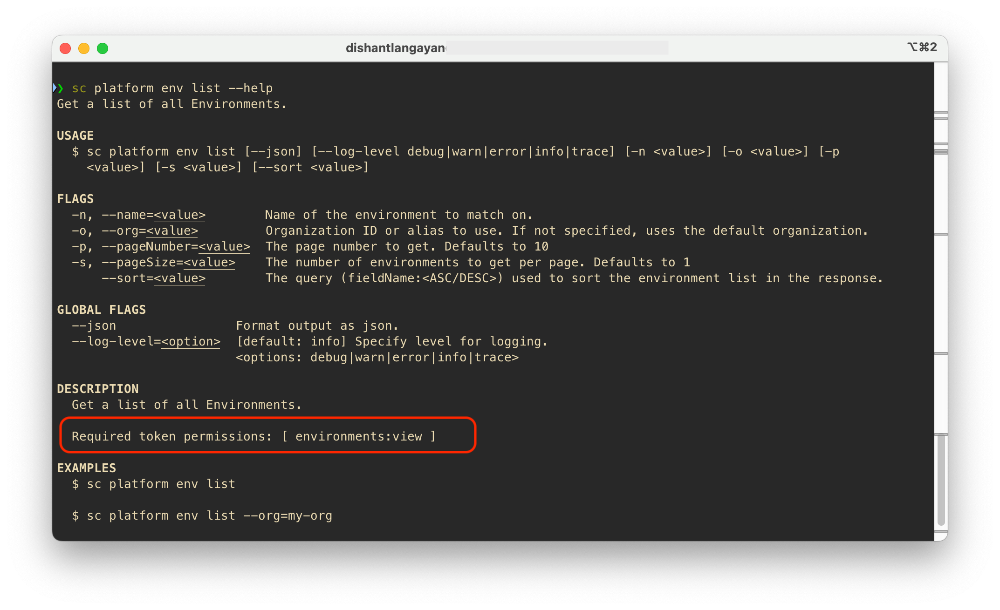
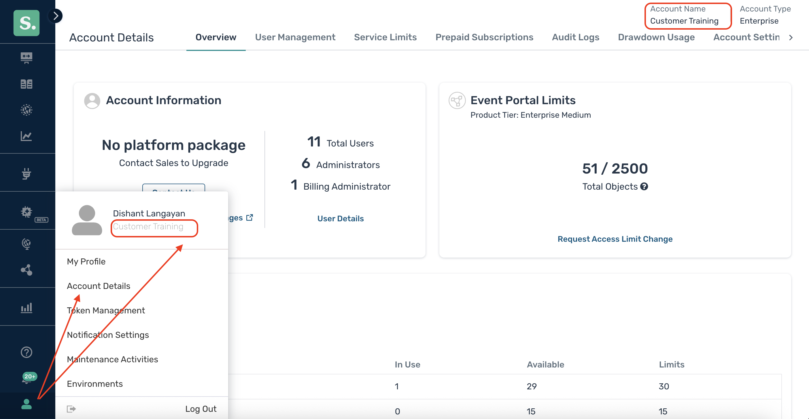

# Solace Cloud Authentication

All SC CLI commands require authentication with either the Solace Cloud Platform or Event Brokers depending on the commands you are running.

This section discusses Solace Cloud authentication. The CLI uses the Cloud v2 REST APIs, which require an API Token.

:::note
For Cloud Event Broker Services and self-managed Software Event Brokers, the commands use SEMPv2 or Legacy SEMP and you authenticate with the broker using Basic or OAuth authentication scheme. 

Refer to the [Event Broker Authentication](./broker-authentication) documentation for more information on this.
:::

## Solace Cloud API Token

To manage Solace Cloud you will need an API Token. Refer to the REST API documentation and Solace Docs for understanding the permission and API Token.

* [Understanding Authentication When Using the REST API](https://api.solace.dev/cloud/reference/authentication)
* [Managing API Token](https://docs.solace.com/Cloud/ght_api_tokens.htm)

You can have multiple API Tokens configured with the SC CLI.

### Permissions

The permissions configured in Solace Cloud for your API Token determine what you are allowed to view, manage, and configure and which commands will successfully run.

Each Solace Cloud command specify the token permissions that it requires for the command to run successfully:



## Org Account Login

Account login authorizes the SC CLI and its commands to make REST API calls with your Solace Cloud platform.

To authorize the CLI to manage and configure your Solace Cloud you will need to login using your API Token:

```bash
sc account login --org <Your Account Name>
```

Each API Token is associated with a Solace Cloud account that has a name. This is referred to as the "org" in CLI commands.



:::tip
Note your Solace Cloud Account Name and the org you provide to login does not have to match, but we highly recommend it does match. 

This also allows you to login to multiple Solace Cloud accounts and execute commands against different accounts.
:::

Once you have successfully logged in you can then use the `--org` flag in commands. For ex:

```bash
sc platform env list --org MyAccountName
```

### Setting the Default Org

When you login you can also specific the org as being the default for command to use.

```bash
sc account login --org <Your Account Name> --set-default
```

:::tip
This is useful if you only have one account you are working with and avoid having to specify the `--org` flag in every command.
:::

## Org Alias

You can configure multiple API Token for a single Solace Cloud account by using the `--alias` flag.

Subsequent commands can then use `--alias` instead of the `--org` flag.

```bash
sc account login --org <Your Account Name> --alias UniqueNameForAPIToken
```

## Logging Out

To delete / de-authorize an API Token, use the logout command. 

```bash
sc account logout --org <Your Account Name>
```

If no specific org or alias flag is provided the command will list all the orgs and you can use the keyboard arrow up/down keys to navigate through the list, spacebar to select one, and enter to confirm your choice. You will be prompted to confirm before the command logs you out.

```bash
sc account logout
```

You can also logout out of all orgs by using the `--all` flag:

```bash
sc account logout --all
```

## Where is the Authentication Information Stored?

All authorized Solace Cloud accounts are stored locally in the user's home directory: `~/.sc/orgs.json` on MacOS/Linux or `%USERPROFILE%\orgs.json`.

Tokens are stored securely using AES-256-GCM encryption. The CLI stores a randomly generated master key in the OS keychain, and combine it with machine ID, to provide a higher level of security. This provides:
1. Strong security through OS-level protection
1. Machine-bound encryption prevents credential theft

The CLI uses operating system's native secure storage to store the encryption key:

* **macOS:** Keychain
* **Windows:** Credential Manager
* **Linux:** Secret Service API (libsecret)
